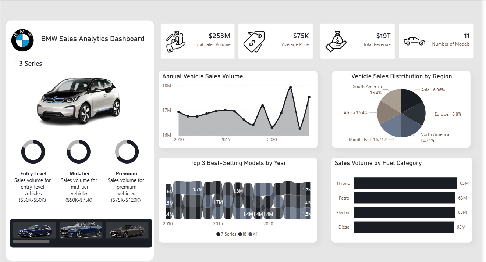

# 🚗 BMW Global Sales Performance Dashboard

> **Market Analytics • Sales Forecasting • Regional Insights**



## 📋 Project Overview

Comprehensive 15-year market analysis of BMW global sales performance analyzing **$253M units** and **$19T revenue** across 6 regions and 11 models to identify market trends, growth opportunities, and strategic insights.

**Project Type:** Market Analytics & Business Intelligence  
**Duration:** June 2025 - July 2025  
**Role:** Market Intelligence Analyst

---

## 🎯 Business Objectives

### Primary Goals:
1. **Trend Identification:** Analyze 15-year sales patterns to identify market shifts
2. **Regional Analysis:** Compare performance across global markets
3. **Product Performance:** Evaluate model-level sales and revenue
4. **Forecasting:** Predict future sales trends for strategic planning

### Key Business Questions:
- How are fuel type preferences evolving globally?
- Which regions show the strongest growth potential?
- What models consistently outperform?
- How can we forecast future market demand?

---

## 📊 Key Insights & Results

### 🌍 Market Trend Analysis
- **Fuel Type Transition:**
  - Hybrid vehicles: **65M units** (leading)
  - Electric vehicles: **63M units** (rapidly growing)
  - Diesel vehicles: **62M units** (declining)
- **Strategic Implication:** Clear shift toward electrification

### 📍 Regional Performance
- **Asia Pacific:** Largest market at **16.96% share**
- **Europe:** Strong traditional market with stable growth
- **North America:** Premium segment focus
- **Emerging Markets:** High growth potential identified
- **Market Distribution:** Balanced global presence across regions

### 🚙 Model Performance
- **Top Performer:** 7 Series - **1.7M units annually**
- **Consistent Sellers:** 3 Series, 5 Series, X5
- **Emerging Stars:** i4, iX (electric models showing rapid adoption)
- **Revenue Leaders:** 7 Series and X7 drive highest revenue per unit

### ⏱️ Operational Impact
- **Analysis Efficiency:** 50% reduction in reporting cycle time
- **Automated Forecasting:** Real-time trend predictions
- **Executive Dashboards:** Self-service analytics for leadership
- **Strategic Planning:** Data-driven market entry decisions

---

## 🛠️ Technical Implementation

### Data Scope
```
Time Period: 15 years (2010-2024)
Total Volume: 253M+ units
Total Revenue: $19T+
Regions: 6 (Asia, Europe, North America, South America, Middle East, Africa)
Models: 11 product lines
Data Points: 180+ monthly records per model
```

### Tech Stack
- **BI Platform:** Power BI Desktop & Service
- **Data Processing:** Power Query (M Language)
- **Analytics:** DAX (Data Analysis Expressions)
- **Time Series:** Native Power BI forecasting + Python integration
- **Statistical Analysis:** Trend analysis, YoY growth, CAGR

### Dashboard Architecture

**3-Page Dashboard:**
1. **Executive Overview**
   - Global KPIs (total volume, revenue, growth %)
   - Regional breakdown
   - Fuel type distribution
   - YoY trends

2. **Regional Deep Dive**
   - Geographic heatmap
   - Regional comparisons
   - Growth rate analysis
   - Market share evolution

3. **Product Performance**
   - Model-level sales
   - Forecasting visuals
   - Fuel type trends
   - Revenue analysis

### Advanced Features
- Time-series forecasting with confidence intervals
- Drill-through from summary to detailed views
- Dynamic filtering by region/model/fuel type
- Automated YoY and MoM calculations
- Mobile-optimized layouts

---
## 📈 Analysis Methodology

### 1. Time Series Decomposition
- Trend analysis (15-year trajectory)
- Seasonality detection
- Cyclical pattern identification
- Forecast modeling

### 2. Regional Comparison
- Market share calculation
- Growth rate analysis (CAGR)
- Competitive positioning
- Opportunity scoring

### 3. Product Portfolio Analysis
- Model performance ranking
- Fuel type distribution trends
- Revenue contribution analysis
- Cannibalization assessment

### 4. Forecasting
- Linear regression for baseline
- Exponential smoothing for trends
- Confidence interval calculation
- Scenario planning (best/worst case)

---

## 💡 Strategic Recommendations

### Market Strategy
1. **Accelerate EV Transition:** Invest heavily in electric model lineup (63M units trending upward)
2. **Asia Focus:** Prioritize Asia-Pacific (16.96% share) for expansion
3. **Premium Positioning:** Maintain 7 Series and X7 as revenue drivers

### Product Development
1. **Hybrid Bridge Strategy:** Use hybrids as transition to full EV
2. **Phase Out Diesel:** Plan systematic reduction in diesel offerings
3. **Model Portfolio:** Maintain balanced mix of sedans, SUVs, EVs

### Regional Tactics
1. **Emerging Markets:** Aggressive expansion in high-growth regions
2. **European Consolidation:** Defend market share in traditional strongholds
3. **North American Premium:** Focus on luxury segment differentiation

---
## 🎓 Key Learnings

- Time-series forecasting techniques in Power BI
- Market analysis frameworks
- Geographic visualization best practices
- Executive-level data storytelling

---