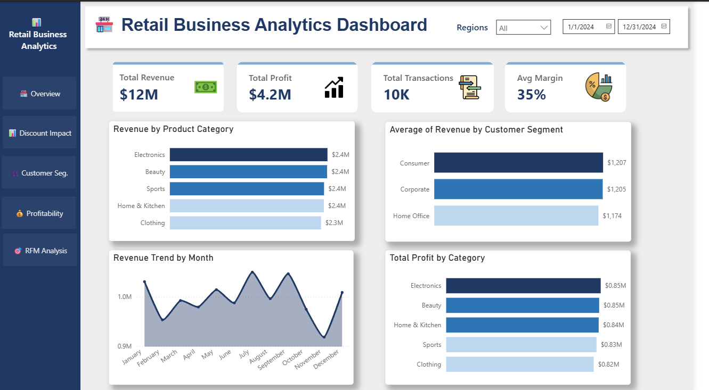

# 🛒 Retail Business Analytics

**End-to-End Business Intelligence Project | Dec 2025**

This project analyzes a **10,000+ retail transaction dataset** to uncover insights on pricing strategy, customer behavior, and profitability. The workflow covers the full analytics pipeline—from **data cleaning and feature engineering in Excel** to **interactive business intelligence dashboards in Power BI**.

---

# 📌 Project Objectives

- Analyze how discounts affect revenue and profit margins  
- Segment customers based on purchasing behavior  
- Identify high-value and at-risk customers  
- Build an interactive dashboard for business decision-making  

---

# 🔎 Key Analyses

### 1. Discount Impact Analysis
Evaluated how different discount ranges affect revenue and profit margins.

### 2. Customer Segmentation
Identified customer purchasing patterns across the dataset.

### 3. Profitability Analysis
Assessed profit performance across transactions to determine profitable segments.

### 4. RFM Analysis
Segmented customers based on **Recency, Frequency, and Monetary value**.

---

# 👥 Customer Segmentation Results

A total of **5,994 unique customers** were segmented into four behavioral groups:

| Segment | Percentage |
|-------|-----------|
| Champion | 13% |
| Loyal | 39% |
| At Risk | 20% |
| Lost | 28% |

---

# 📊 Dashboard

Developed a **5-page interactive Power BI dashboard** featuring:

- KPI cards for key performance metrics  
- DAX measures for dynamic calculations  
- Slicers and filters for interactive exploration  
- Cross-filtered visualizations for deeper analysis  

---

# 💡 Key Insights

- The **1–10% discount range generated the highest revenue ($4.4M)** with a **35% profit margin**  
- **28% of customers were classified as Lost**, highlighting opportunities for customer re-engagement strategies  

---

# 🛠 Tools & Technologies

**Microsoft Excel (Advanced)**  
- Data cleaning and feature engineering  
- Analytical formulas: `SUMIF`, `COUNTIFS`, `AVERAGEIF`, `INDEX-MATCH`

**Power BI**
- Data modeling  
- DAX measures  
- Interactive dashboard development
